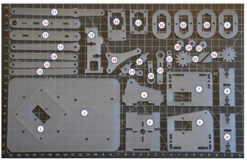
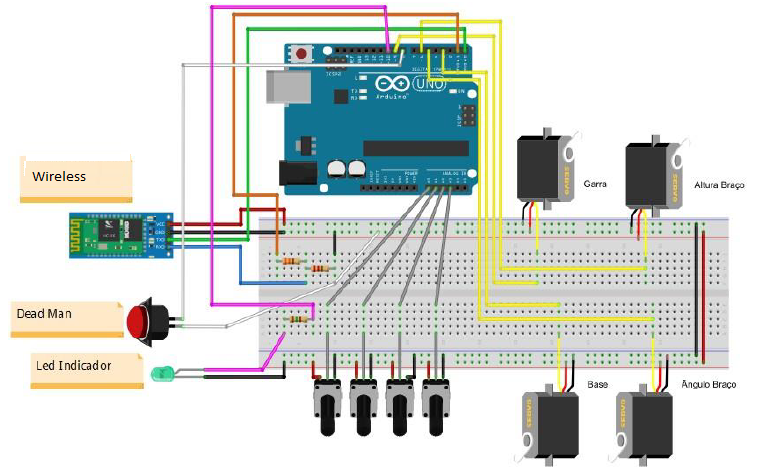

     
#   Projeto 
## Braço Robótico aplicado em Fábricas 

 O projeto consiste na construção de um braço robótico e de um Software de controle que tem como finalidade a rápida manipulação de peças em um processo de fabricação industrial.

## Descrição de Hardware 

### Lista de Materiais 

o	4 – Servos motores, modelo SG90;

o	4 – Potenciômetros 100 k;

o	1 – Botão push button N/A;

o	2 m – Cabo sem manga 8 vias;

o	1 – Fonte 5v 3A;

o	1 – Caixa Patola PB 114 TE

o	1 – Arduino Uno R3 ou compatível;

o	1 – Módulo bluetooth HC- 06;

o	4 – Knobs;

o	1 – Resistor 220R;

o	1 – Resistor 330R;

o	1 – Resistor 150R;

o	Fios Jumpers para Arduino;

o	Parafusos.

o	1 – Braço comercial em acrílico modelo ARM2;

 
## Replica em madeira 

Descrição da montagem do arduino
### Steps : 

o 1º  Os palitos de sorvete foram perfurados nas pontas, permitindo que os parafusos fossem inseridos e prensados.

o 2º  O arduino foi conectado com a placa do shield para permitir a duplicação das portas analógicas 

o 3º  Os jumpers foram inseridos nas portas analógicas utilizadas, com o objetivo de conectar com a placa do shield. 

## Plataforma de Desenvolvimento

o	IOS – Aplicativo Mobile 
o	C++ - Arduino 

### Desenho Tinkercad 
 
 
 

 ### Esquema eletrônico
 
 

 

