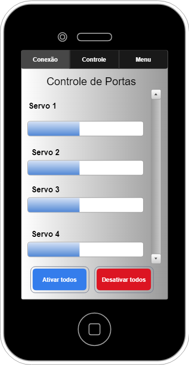
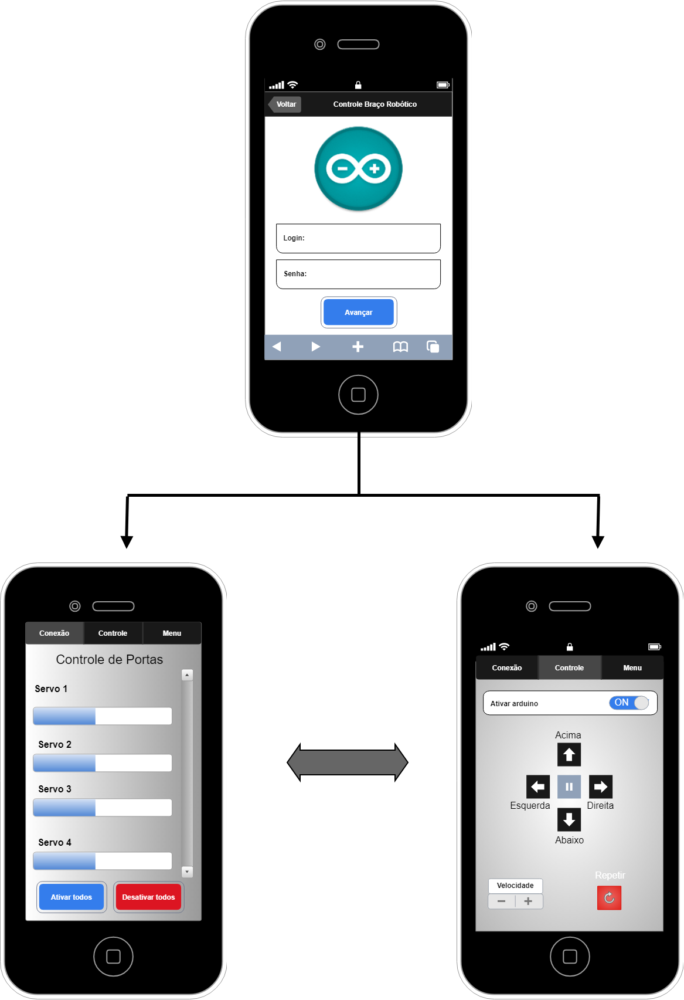
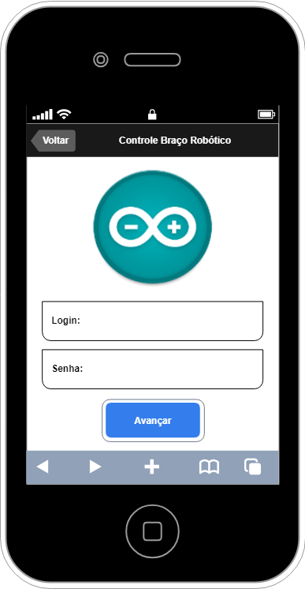
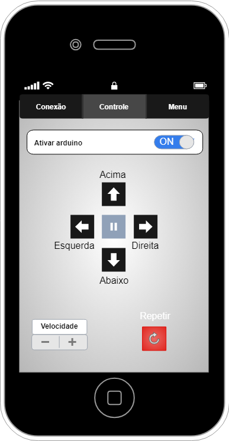
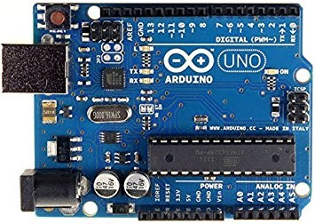
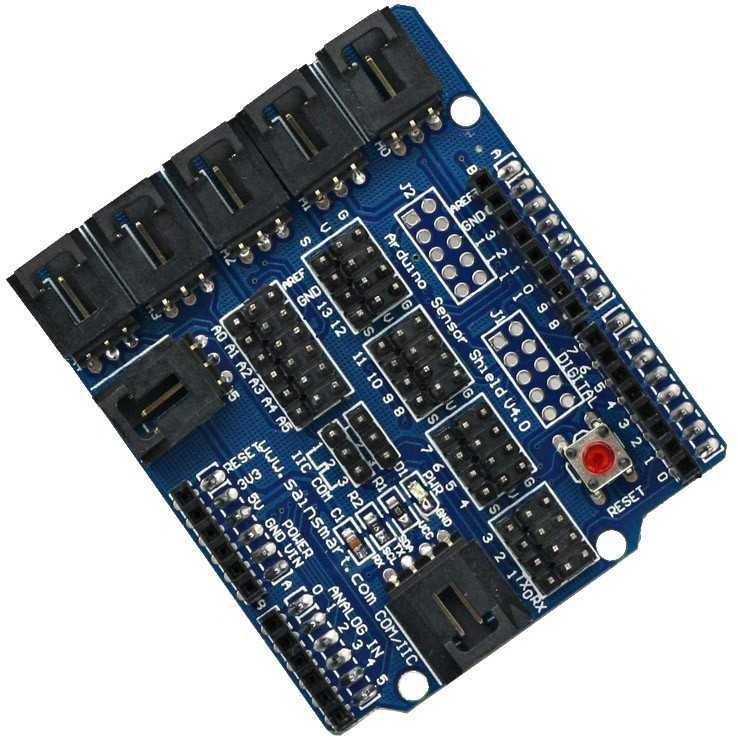
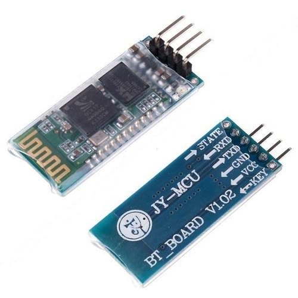

Projeto 
Braço Robótico aplicado em Fábricas
                         

Interfaces e comunicação

•	Interfaces Gráficas (GUI)
   O aplicativo para movimentar o Braço Robótico será desenvolvido para plataformas mobile.

1.Servos

1.2.Navegação
 

1.3.Login

 

1.4.Controle
 

•	Placas 
O projeto utiliza Protocolo Wireless e utiliza o Bluetooth como forma de conexão.

2.Arduino Uno
	  
	  
2.1.Arduino  Sensor  Shleldv5.0
  
	  
2.3. Modulo Bluetooth HC-06
  
  
•	Protocolos de Comunicação 
o	Baseband: camada que determina como os dispositivos localizam e se comunicam com outros aparelhos via Bluetooth.
o	LMP (Link Manager Protocol): essa camada responde por aspectos da comunicação em si, lidando com parâmetros de autenticação, taxas de transferência de dados, criptografia, níveis de potência, entre outros;
o	HCI (Host Controller Interface): camada que disponibiliza uma interface de comunicação com hardware Bluetooth, proporcionando interoperabilidade entre dispositivos distintos;
o	L2CAP (Logical Link Control and Adaptation Protocol): essa camada serve de ligação com camadas superiores e inferiores, lida com parâmetros de QoS (Quality of Service — Qualidade de Serviço), entre outros.
o	Firmata (USB-Serial): será utilizado para programar no Arduino através de um computador host.  

•	Protocolos de Aplicação 
o	WAP(Wireless Application Protocol): protocolo de aplicação sem fio. 
